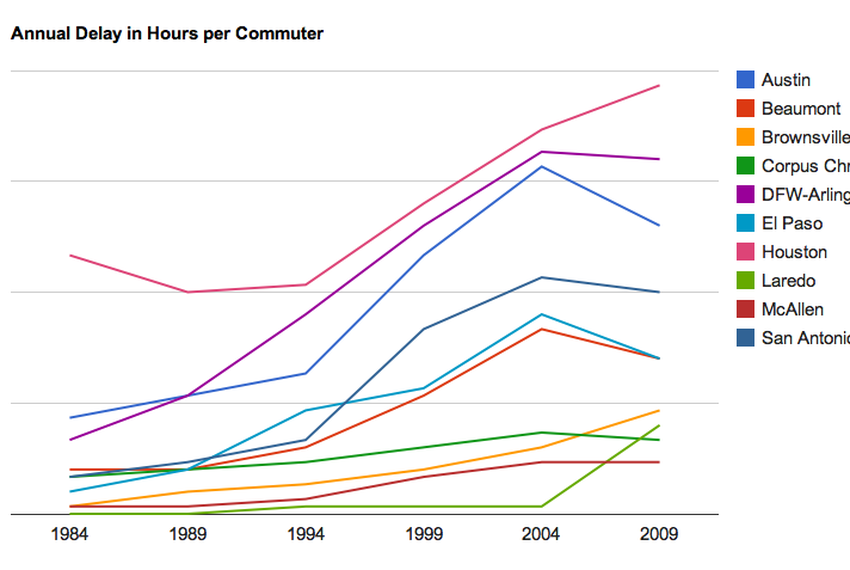
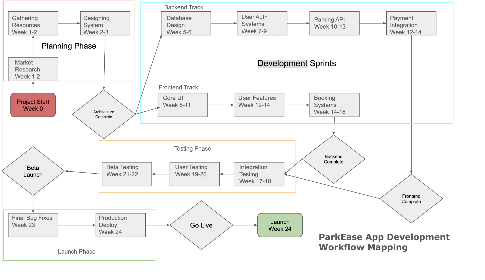

## ParkEase

Name: Amaan Khan

Semester: FA 24

Personal Website: www.khanamaan.com

|  | 

(C.M, 2014)

### Introduction   

[Comment_1]: <> (begin your text here)

In our increasingly urbanizing world, the challenge of finding parking has become a daily problem for millions of drivers. Cities struggle with congestion which leads to drivers wasting countless hours searching for spaces and valuable parking resources often sit unused because they couldn't be found. This inefficiency not only impacts individual productivity but also contributes to increased carbon emissions. 

This is where comes in ParkEase, which is an innovative platform that reimagines parking space utilization through digital means. Very similar to how Airbnb revolutionized accommodation sharing, ParkEase similarly aims to transform how we use parking spaces in urban environments.

The platform enables real-time discovery, booking, and payment for parking spaces while simultaneously allowing space owners to generate passive income from their underutilized spaces. This project represents an intersection of mobile technology, sharing economy principles, and urban infrastructure optimization.

The purpose of this is to explore the aspects of ParkEase, from its technical implementation to its community impact. In this paper, we will look into the motivation behind the project, its technical architecture, implementation strategy, and the crucial aspects of community building that will determine its success.

[Comment_2]: <> (An example of a reference in paper text, cite in Reference list -- see Comment 8)

#### Project Motivation
[Comment_3]: <> (begin your text here)
My interest in developing ParkEase is due to personal experiences and observations of the widespread problems in urban parking systems. Having lived in a major city since birth, I have witnessed countless drivers circling blocks searching for parking and seeing empty private parking spaces go unused, I recognized an opportunity to create meaningful change through technology. The project represents more than just a business opportunity, it's a chance to solve a real world problem that affects millions of people daily.

The significance of this project extends beyond individual convenience. Studies show that up to 30% of urban traffic can be attributed to drivers searching for parking spaces (FHWA Office of Operations, n.d.). This unnecessary cyclic process contributes to traffic congestion, increases pollution and wastes valuable time and fuel. By creating a platform that efficiently connects drivers with available parking spaces, my app ParkEase has the potential to significantly reduce these negative impacts on urban environments and save precious time for millions of individuals.

The market opportunity is equally compelling. With urbanization continuing to increase globally, the demand for efficient parking solutions will only grow. Current solutions often focus mainly on public parking facilities or specific private lots which leaves a vast network of potential private parking spaces unused. ParkEase will solve this by creating a marketplace that includes both traditional parking facilities and private spaces which will maximize the utility of existing infrastructure.

[Comment_4]: <> (Insert Figure with caption here)

|  | 
| :--: |
| <b>Figure 1.</b> Hours spent in traffic in Texan cities. (Aaronson, 2024) |
 

#### Technical Vision & Implementation  

[Comment_5]: <> (begin your text here)

The technical architecture of ParkEase is designed for scalability, reliability, and user experience. The project is structured into distinct phases that ensure systematic progress while maintaining flexibility for adaptation based on user feedback and changing requirements.

The backend track is from database design to payment integration which forms thefoundation of the platform. Using modern technologies like cloud infrastructure, the system will handle real-time booking requests, secure payments, and update space availability dynamically. The development sprints are carefully planned across 24 weeks, just under 6 months, with clear milestones and deliverables at each stage.

My technical implementation begins with a scalable database design for managing user profiles, parking spaces, and bookings. This foundation is very important for handling the relationships between users, space owners, and their transactions. Building upon this, we implement user authentication systems that ensure secure access and protect user data while maintaining a seamless experience. The comprehensive parking API serves as the core of our system as it manages everything from space discovery to reservation management while also integrating with various payment systems to support multiple transaction methods. Throughout the platform, real time availability tracking and notification systems keep users informed and engaged.

The frontend track focuses on creating an intuitive user interface that makes finding and booking parking spaces as simple as possible. The UI development which is currently scheduled for Weeks 8-11 will establish the fundamental user experience. This phase is followed by the implementation of specific user features and booking systems which would help ensure that the platform remains user centric while maintaining technical excellence. The frontend development emphasizes responsive design and accessibility while making sure that users can easily access the platform across various devices and screen sizes.

#### Community Building & Engagement  

[Comment_6]: <> (begin your text two spaces after the last underscore in the previous line)
The success of ParkEase heavily depends on building a strong community of users and space providers. Our approach to community building is multi faceted as we target different user profiles with tailored engagement strategies. The primary user base consists of car owners and rental car companies with early users expected to be commuters who work near parking lots.

Our community engagement strategy uses social media platforms such as Instagram and TikTok to reach potential users, while also conducting direct outreach to businesses near parking lots to develop employee parking solutions. We're establishing partnership programs with parking space owners to ensure a steady supply of available spaces which is the base of our project while also implementing comprehensive feedback systems that encourage continuous improvement of our service. Regular user surveys help us understand changing needs and preferences which would help us to adapt our platform accordingly.

To ensure sustained growth, we're also implementing a contributor program that attracts both technical and non-technical participants. The project team structure includes frontend developers, backend developers, product managers, QA managers and marketers each playing crucial roles in building and maintaining the platform. This diverse team composition ensures that all aspects of the platform receive expert attention and development.

The marketing strategy focuses on creating meaningful connections with our target audiences. Through social media advertising, we reach urban commuters who face daily parking challenges. Our business partnerships with local companies help establish ParkEase as a trusted solution for employee parking needs. We are also actively recruiting developers and interns interested in contributing to the project which in turn offers them valuable experience and the opportunity to make a real impact on urban mobility. We also plan on conducting regular community events and workshops for parking space owners help build trust and ensure their needs are met while creating a sense of community amongst our stakeholders.

[Comment_4]: <> (Insert Figure with caption here)

|  | 
| :--: |
| <b>Figure 1.</b> Project Plan Mapping |

#### Project Management

A proper and successful implementation of ParkEase requires a carefully designed project management strategy that matches with our 24 week development timeline. Our approach combines agile methodologies with traditional project management principles which ensures both flexibility and structural integrity throughout the development process. The project workflow is further divided into distinct phases in which each comes with specific objectives and deliverables that build upon previous accomplishments.

The team structure reflects the complexity and ambition of the ParkEase platform. The core development team consists of specialized units working in parallel tracks i.e frontend and backend. The frontend team focuses on user interface development and user experience optimization whereas the backend team handles server infrastructure, database management, and API development. There are also Quality Assurance specialists who work across both tracks and ensure consistent quality and seamless integration between components. Project managers oversee each track and maintain communication channels and ensuring alignment with overall project goals.

The development timeline is designed to optimize resource utilization and maintain steady progress. The initial planning phase which spans around weeks 1-3 involves intensive market research and system design. This foundation setting period is very important for defining technical requirements and establishing development standards. After that, the next phase is the architecture phase where backend and frontend tracks begin their parallel development cycles. Our workflow mapping indicates critical intersection points where these tracks must synchronize particularly during the integration testing phase in weeks 17-18.

The Resource allocation follows a subject to change model that adapts to changing project needs. During intensive development phases such as the core UI development in weeks 8-11, additional resources are allocated to ensure timely completion. And similarly, during critical integration periods, cross functional teams are formed to address challenges efficiently.

Finally, risk management is integrated into every phase of the project. Potential technical challenges such resource constraints and external dependencies are identified early and monitored continuously. Properly defined and studied plans are developed for critical components and regular risk assessment meetings help maintain project momentum while addressing emerging challenges. This proactive approach to risk management is essential for maintaining project timelines and quality standards.

#### Practical Applications & Challenges

The implementation of ParkEase in real world environments presents both exciting opportunities but scary challenges that require careful consideration and innovative solutions. The practical application of our platform must address various stakeholder needs while navigating technical, social, and regulatory landscapes.

Technical implementation poses several challenges. Integration with existing city infrastructure requires careful consideration of various parking sensor systems, payment processors, and traffic management systems which could be very challenging. Our solution involves developing flexible API adapters that can interface with different municipal systems while maintaining consistent functionality across the platform. Additionally, real time data synchronization between multiple users and parking spaces demands proper error handling and conflict resolution mechanisms to prevent double booking and ensure accurate availability information.

Security and privacy considerations form another very important aspect of practical implementation. User data protection, secure payment processing, and fraud prevention require sophisticated security protocols. We implement end-to-end encryption for sensitive data, 2FA authentication for user accounts, and advanced fraud detection algorithms with the help of our software engineers to monitor suspicious activities. Regular security audits and penetration testing ensure the platform remains resistant to emerging cyberthreats.

The regulatory landscape comes with various challenges across different jurisdictions. Parking regulations with payment processing requirements and data protection laws vary significantly between cities and countries. Our platform must maintain compliance while remaining flexible enough to adapt to local requirements. This includes implementing configurable rule engines that can accommodate different parking regulations and pricing models as well as establishing partnerships with local authorities to ensure regulatory alignment.

User adoption and behavior change also represent significant practical challenges. Converting traditional parking habits to a digital platform requires careful consideration of user experience and education and could be very challenging at first. We address this through intuitive interface design, clear user guidance, and responsive customer support along with an AI chatbot for quick results. Additionally, we implement a feature rollout strategy which would allow users to adapt to basic functionality before introducing more advanced features.

Parking space verification and quality control present unique operational challenges. Ensuring that listed spaces meet our standards and are accurately represented requires a combination of technological solutions and human oversight. We implement automated verification systems using satellite imagery and user feedback which are supplemented by periodic physical inspections for high traffic locations.

The challenge of maintaining consistent service quality extends to both space providers and users. We address this through a rating system with dispute resolution procedures and clear communication channels. Regular quality assessments and feedback collection help identify areas for improvement and maintain service standards.

Economic sustainability requires careful balance between platform costs and user value. Our revenue model must account for various operational expenses while remaining attractive to both parking space owners and users. Again with the help of software engineers, we implement  pricing algorithms that consider factors such as location, demand, and time of day to ensure fair compensation for space owners while maintaining competitive rates for users.

#### Future Development

The future development roadmap for ParkEase extends beyond its initial implementation as we envision a  evolution that adapts to emerging technologies and changing urban needs. Our scalability strategy includes both technical expansion and market growth which ensures the platform remains relevant and efficient as demand increases.

Technological advancement stands at the top of our future development plans. Integration of machine learning algorithms will enhance our parking space prediction system and also analyze historical data patterns to forecast availability and optimize space utilization. These predictive capabilities will help users find parking more efficiently while enabling pricing models that reflect real time demand patterns similar to how Uber's pricing works. 

Platform expansion will include the development of specialized features for different user segments. Corporate parking management tools will allow businesses to efficiently manage employee parking allocations and visitor spaces. Event parking management systems will help venues coordinate large scale parking operations during concerts, sports events, and conferences. Integration with smart city initiatives will enable proper coordination with traffic management systems and reduce congestion and improve urban mobility.

Infrastructure scalability remains a critical focus for future development. Our cloud based architecture will expand to include edge computing capabilities which would reduce latency and improve real time response rates. The implementation of microservices would help ensure that individual components can be scaled independently based on demand. Database sharding and replication strategies will maintain performance as the user base grows while content delivery networks will ensure consistent service quality across geographic regions.

Anohter feature which we would like to properly develop is the mobile application capabilities whhich will evolve to include augmented reality features which would help users visually navigate to their reserved spaces. Integration with car systems will allow for seamless communication to enable automated check ins and payment processes. These technological advancements will reduce issues in the parking experience and increase platform adoption.

Community growth initiatives focus on expanding the network effect of our platform. Partnership programs with property developers will integrate ParkEase into new construction projects and ensure parking space availability grows alongside urban development while keep ecological concerns in mind. Proper collaboration with municipal authorities will help optimize public parking resources and reduce urban congestion through improved space utilization.

### Conclusion      

[Comment_7]: <> (begin your text here)

ParkEase represents a innovative approach to urban parking management and addresses fundamental inefficiencies in current systems while creating new opportunities for space utilization through careful technical implementation, community engagement, and strategic development.

The impact of ParkEase is not limited to simple parking space management. By optimizing resource utilization and reducing search times, the platform contributes to reduced urban congestion and lower carbon emissions. The economic benefits for space owners create incentives for better space utilization while improved parking accessibility enhances urban mobility and quality of life.

Technical implementation challenges have been addressed through thoughtful architecture design and phased development approaches. The backend infrastructure ensures reliable service delivery while the intuitive frontend interface promotes user adoption and engagement. Security measures and privacy protections build trust among users leading to creation of a sustainable platform for long term growth.

Project management methodologies have proven effective in maintaining development momentum while ensuring quality standards. The careful balance of agile practices with structured oversight has enabled efficient resource utilization and timely milestone achievement. This approach will continue to guide future development efforts and ensure sustainable growth and technical excellence.

Looking forward, ParkEase is well positioned to adapt to emerging advancements in technologies and changing urban needs. The scalable architecture and flexible development framework provides a strong foundation for future expansion which will be easy to add. Continued focus on user experience and community engagement will drive adoption and increase the chances for long term success.

As cities continue to grow and evolve, the need for efficient parking solutions becomes increasingly critical. ParkEase stands ready to meet this challenge and provide a neat platform that benefits all stakeholders while contributing to improved urban mobility. With the help of continued development and community engagement, the platform will remain as the benchmakr of parking innovation and help to shape the future of urban transportation and space utilization.

The journey of ParkEase from concept to implementation demonstrates the power of technology to address real-world challenges through innovative solutions. As we move forward, so does our commitment to technical excellence, user satisfaction.

### References     

[Comment_8]: <> (begin your reference list here. Cite as author, year in main text. Reference link should correpond with link in Comment 2  Use any format you wish -- MLA, APA, etc.)

FHWA Office of Operations - Parking Cruising Analysis Methodology Project Report. (n.d.). https://ops.fhwa.dot.gov/publications/fhwahop23004/ch1.htm#:~:text=30%25%20of%20urban%20traffic%20comes,downtowns%20are%20searching%20for%20parking.

Aaronson, B. (2024, February 6). Report shows traffic growing problem in Texas. The Texas Tribune. https://www.texastribune.org/2011/01/20/report-shows-traffic-growing-problem-in-texas/

C. M. (2014, September 17). Where do I park my car? ActiveRain. https://activerain.com/blogsview/4492234/where-do-i-park-my-car-

Cite as the form (Lastname, 2023) in the body of your text. List reference citation in this section. 