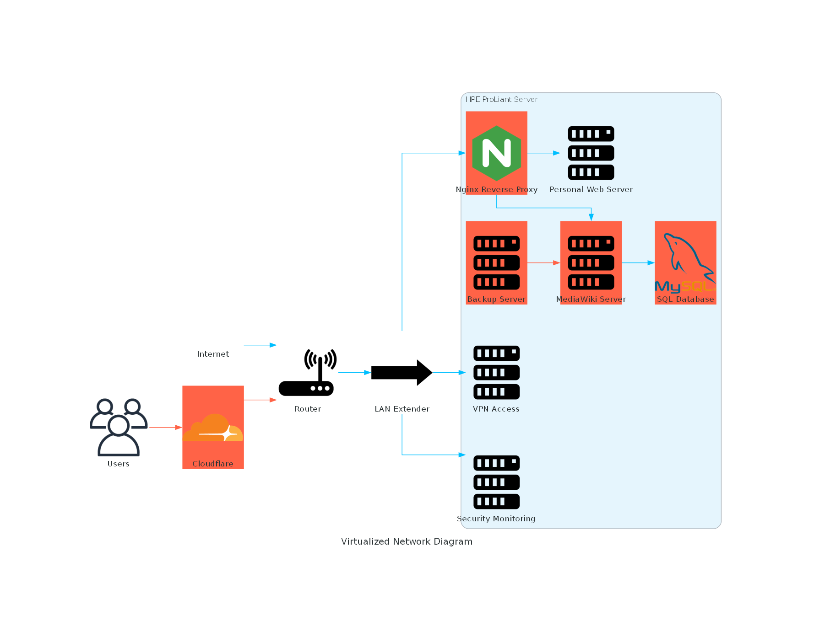
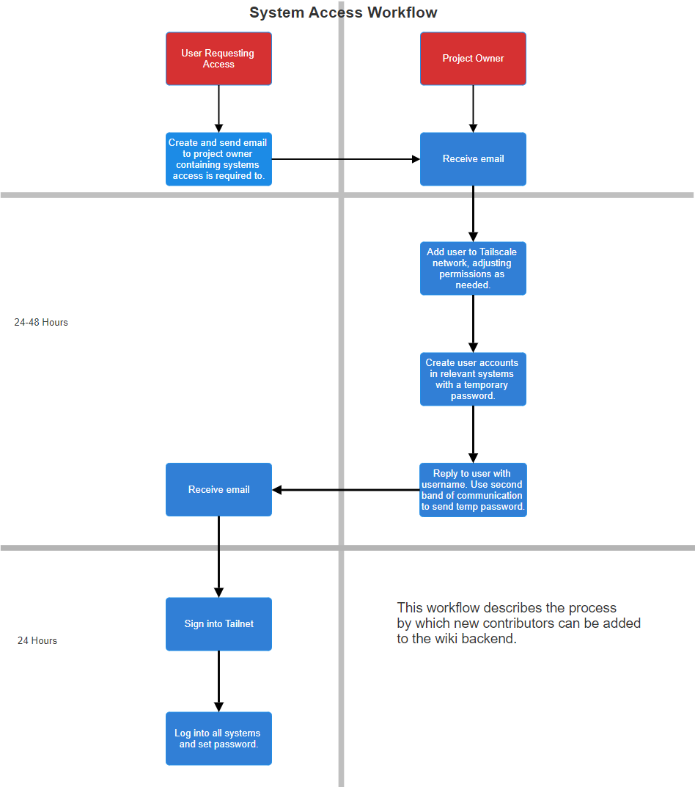

## IT Wiki Project Final Paper
Name: Blake Mackin

Semester: Fall 2024

Personal website: www.blake4it.com

### Abstract 

  The goal of this project is to develop a secure and scalable IT Wiki for IT professionals, DIY
enthusiasts, and more. The core of the project will be built using MediaWiki; the platform will allow
content creation and viewing while integrating a stack-overflow-like forum where users can get
assistance from the community and a request forum for new topics to be added to the wiki itself. All of
this will be hosted locally and cheaply initially while still maintaining flexibility and usability thanks to
Tailscale, which allows for secure remote connections; Veeam, which will allow for automated off-site
backups; and Security Onion for network security monitoring. Despite having large technical debt
common with self-hosting, the project mitigates this with the use of strong security practices, mature
frameworks, and off-site backups. The final result is a community-driven IT wiki that minimizes
technical debt while ensuring scalability and reliability.

### Introduction

  There is an abundance of IT tutorials and forums on the internet, so you may be wondering why
an IT wiki is necessary at all. The problem with all the information on the internet is that it lacks a
central repository. Anyone who has worked regularly with computers has had the frustrating experience
of looking for information about an issue on old forums and only finding a dead link followed by,
“Thanks! That worked.” The lack of a single platform wastes the time of IT professionals and makes it
difficult for individuals who lack expertise to get help. With this project, both tutorials and forums will
be kept together in a central repository for anyone to use for free. While starting small and self-hosted,
this project will ideally grow into a community-driven platform where users can upload their own
tutorials and help each other solve problems. As an IT professional, I aim to carefully manage technical
debt, particularly since self-hosting is prone to technical debt. We carefully selected mature
frameworks, employed automation, and implemented robust security measures to ensure that this
project is both scalable and reliable. This project aims not only to simplify access to IT knowledge but
also to make it more accessible to users of all levels.

### Problem Statement     

  As mentioned earlier, there does exist a large amount of IT information online. Beyond
information not being centralized, there are many other issues, such as old forums being shut down or
abandoned, access to help being paywalled for paid platforms like RedHat, or answers being buried in
pages of irrelevant content. All of this wastes the valuable time of professionals and hobbyists. On top
of a lack of accessibility, many of the existing resources are limited to a static Q&A format, restricting
users and contributors from requesting more in-depth content or contributing their own expertise. The
lack of a centralized, interactive community means that users have to navigate many sites and search
through potentially outdated solutions. To address these problems, a centralized platform that organizes
and stores information will empower its users, allowing for greater collaboration and providing clear
guidance to those who seek it out.

### Project Vision: Milestones
**Milestone 1:** Local Development and Core Wiki Functionality

Objective: Establish a locally hosted and fully functional IT Wiki and forum.

Key deliverables:

• Set up MediaWiki with core features such as content creation and viewing

• Integrate a simple stack overflow-like Q&A forum.

• Implement Tailscale for secure remote access. (Complete)

• Automate off-site backups using Veeam to ensure data recovery in case of disaster.

• Deploy Security Onion for monitoring potential network threats.

• Configure Cloudflare for advanced DDoS protection.

Timeline: 1-2 months.

**Milestone 2:** Expanding User Features

Objective: Enhance site usability and build community by encouraging engagement.

Key deliverables:

• Add separate request forum where users can suggest new topics to be added to the wiki.

• Enable user registration with roll based permissions.

• Develop a basic tutorial and guidelines for Wiki contributions.

• Hire an artist for logo creation and overall site styling.

• Add content to the wiki.

Timeline: 4-6 months.

**Milestone 3:** Building Community Engagement

Objective: Foster an active community that encourages collaboration. Hire or select community
members for internal teams and moderation roles.

Key deliverables:

• Establish guidelines for internal team members and moderators.

• Document internal processes to preserve institutional knowledge.

• Implement community driven features like voting and reporting.

• Perform outreach to help build community.

• Conduct research on suitable cloud service providers.

Timeline: 6-12 months.

**Milestone 4:** Cloud Migration and Scalability

Objective: Transition to a cloud-based infrastructure to support larger community.

Key deliverables:

• Migrate to a scalable cloud platform.

• Replace dedicated SQL database server with managed database services.

• Perform various stress testing to ensure platform can handle increased traffic.

• Implement advanced security measures as needed.

Timeline: 1-2 years or as needed if growth exceeds expectations.

**Milestone 5:** Long-Term Growth and Feature Expansion

Objective: Solidify the IT Wiki as a sustainable, community driven platform.

Key deliverables:

• Expand support for content like videos, audio, and interactive tutorials.

• Integrate advanced analytics to better track trends and identify where growth is needed.

• Encourage community lead feature development.

• Formalize governance positions to manage long term operations.

Timeline: 3-6 years.

### Technical Infrastructure 

  The initial technical stack will be built locally. This is for several reasons. The major reason is
monetary. By hosting locally, I will only have to pay for power and the domain of the site. This does
not account for hardware degradation like hard drive failure or disaster, but even including those
options, as long as I have a functioning backup system, it will be substantially cheaper than cloud
hosting. The local technical stack will be as follows:

 

The network elements in red are those that are planned or not completely implemented at the
moment. All of the virtual servers will be hosted on an HPE ProLiant DL360 Gen10 server with dual
Intel Xeon Gold 5220 CPUs with a total of 383 GB of memory. The max bandwidth of the router is
limited by the LAN extender, which allows a maximum throughput of 100 MB/s. This is a major
source of technical debt and what will likely eventually force cloud migration. To allow secure remote
access to the virtual servers, Tailscale is utilized. Tailscale is a simple, secure, and private identity-
based network that is able to operate on almost all systems. It includes a flexible topology, secure
networking, and is simple to set up on both servers and client computers. It is end-to-end encrypted,
ensuring that communication between servers and users is secured. Best of all, its non-enterprise
version is completely free (Tailscale Quickstart, n.d.). Security monitoring is done via Security Onion.
This is an incredibly flexible and scalable network security tool. It offers basic signature-based
detection, host visibility, honeypots, and full network capture (Security Onion Solutions, n.d.). In the
current system, it is running as a standalone application, and due to the flexibility it provides, it can still
be used even in the cloud or other distributed environments. Nginx will act as a reverse proxy. This is
necessary due to the fact that multiple websites will be hosted on the same server. Normally this isn’t
an issue, but to save costs, the entire network uses network address translation (NAT), which allows
devices in a private network to only use one public IP address. This can cause issues when multiple
similar servers (e.g., web servers) use the same public IP address. A reverse proxy is needed to direct
traffic accordingly and also provides some security benefits. Next, web traffic will be routed through
Cloudflare. This also provides security benefits like DDoS protection. Lastly, the actual wiki service
will be provided using MediaWiki. MediaWiki is a powerful collaboration and documentation platform
used by sites like Wikipedia. It is completely free and receives constant updates and security patches. It
is also quite customizable and offers powerful content moderation tools (Contributors to Wikimedia
projects, 2023).

### Minimizing technical debt

  Technical debt is unavoidable in any project, and the technical stack selected for this project
carries quite a bit of it. Self-hosting was selected as the cheapest option, and while not all self-hosting
setups have lots of technical debt, due to essentially being a server in a basement, there is lots to
account for. The first step taken to mitigate technical debt was taken with the configuration of the
server itself. The storage is provided with a series of SATA drives in the RAID 5 configuration. What
this means is that if one of the hard drives fails, the server will be able to continue running with no data
loss. While not foolproof, this provides some redundancy even without accounting for backups.
Moving on to backups themselves, being in a single place means that in case of fire or other disaster, all
the hardware could be irreversibly damaged. To mitigate this risk, Veeam will be utilized to
automatically take daily, weekly, and monthly backups. This provides several benefits outside of
disaster recovery as well. These backups could be used in cases of cyber attacks or to roll back faulty
updates. The next measure is the use of Cloudflare. Cloudflare will act as the intermediary between my
servers and users. This allows Cloudflare to mitigate the effects of DDoS attacks and will prevent
people from locating the address that the server is at. The selection of mature frameworks like
MediaWiki is also a form of technical debt minimization. Due to the constant updates and popularity of
MediaWiki, the risk of that framework being used to exploit a vulnerability is very low. It also reduces
the amount of work substantially compared to making your own wiki framework. The last major
technique used is separating servers by role. Instead of combining the database server and the server
that serves the web pages to users, they are each their own individual server. This is a major benefit in
case of a cyber attack that compromises the MediaWiki and makes data loss much less likely and
recovery pain free.

  Despite taking measures to address technical debt, it is impossible to avoid it entirely. The
technical stack has a multitude of points that are considered single points of failure; if any one of the
following gets affected, the whole system will no longer function as intended: the router, LAN
extender, HPE ProLiant server, any interruptions from the ISP, the SQL database, and the MediaWiki
server itself. While any one of those being affected won’t necessarily cause permanent damage, it could
still cause downtime. Other forms of technical debt will come in the form of scaling. Bandwidth limits
and storage will eventually be exhausted, requiring cloud migration.

### Technical Debt Over Five Years

  Once the wiki is mature and with a dedicated user base, we will want to migrate to the cloud.
Cloud migration will be a massive benefit, completely removing the issue with single points of failure.
This decision is not one to be taken lightly, however. While each cloud service provider essentially
provides the same service, they each have slightly different services, features, and pricing.
Furthermore, through something known as vendor lock-in, changing cloud service providers after
committing to one is an extremely expensive and difficult task. As such, this will need to be discussed
with cloud experts before locking in. Migration will also solve issues with scaling. With the current
setup, maximum bandwidth is limited to 100 MB/s. While more than enough initially, a large volume
of wiki edits and page visits will eventually be more than that can handle, resulting in slow page
loading or crashes. Cloud service providers also effectively have unlimited amounts of storage,
completely solving the issue of storage. There will still be some technical debt even with the cloud. We
will need to ensure proper documentation to ensure that new team members are able to be onboarded
quickly and able to perform their duties, particularly as the project grows larger. There will also be the
issue of funding, as cloud hosting can be expensive.

### System Access Workflow

  An example of a process used in the project is how new internal team members will be
onboarded:

  To ensure maximum security, we will avoid using shared accounts. When a new team member
is added to the group, they will email the project owner their role and the systems that they will need
access to. The project owner will then create their Tailscale account, which will allow the new member
to access internal resources securely. Then the project owner will create accounts on all servers where
access is required. Throughout the project, we will be utilizing the principle of least privilege, where
users and team members only have access to the resources that they need and nothing else. After
creation, the project owner will email the new team member their account information and contact
them another way with their temporary password. The team member will then log in to all accounts and
set their own secure password. This process should take no more than 72 hours from start to finish to
ensure that no time is wasted.

### Future Scalability

  While the initial setup is fairly inflexible in terms of resources, once migration to the cloud has
occurred, we will have many more options. The storage, bandwidth, and other resources provided by
cloud service providers are typically fairly fluid, with customers able to use more or less as needed, as
long as they pay the difference. This will allow the wiki to grow to a much larger size or even shrink in
situations where usage rates drop. To help grow our user base, we will need to conduct outreach,
reaching out to IT personnel and potentially partnering with other wikis and conducting hackathons to
raise awareness and attract people to the project.

### Conclusion

  In conclusion, this project seeks to address the limitations of fragmented and difficult-to-access
IT knowledge by creating a centralized, community-driven IT wiki that balances scalability, reliability,
and security. By carefully selecting mature frameworks and implementing robust security practices and
automated backup solutions, this project minimizes technical debt and monetary cost while still
remaining flexible for future growth. By starting with a self-hosted technical stack, we establish a cost-
effective foundation while planning for the eventual cloud migration to support a growing user base.
This long-term vision ensures that this IT wiki evolves into a sustainable project, empowering
professionals, hobbyists, or anyone struggling with IT issues with accessible, collaborative, and
dynamic solutions to their IT problems.

### References     

Contributors to Wikimedia projects. (2023, December 29). MediaWiki. MediaWiki.
https://www.mediawiki.org/wiki/MediaWiki

Security Onion Solutions. (n.d.). Security Onion. https://securityonionsolutions.com/software

Tailscale quickstart. (n.d.). Tailscale. https://tailscale.com/kb/1017
